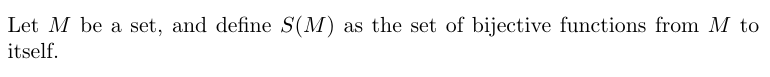
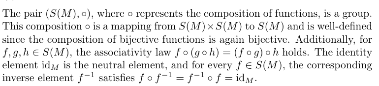
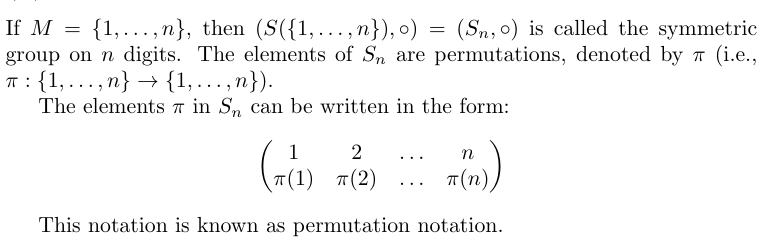
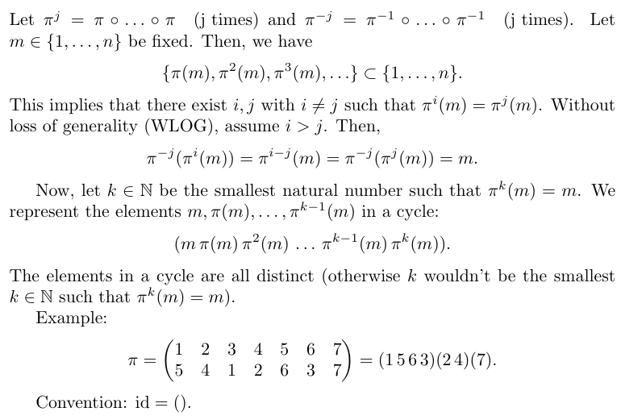

# permutation
This Python library provides a versatile implementation of permutations in the context of abstract algebra. Specifically, it focuses on permutations as elements of symmetric groups defined over finite sets. The symmetric group's operation is based on the composition of functions, with elements representing bijections from a set to itself.

## Symmetric Group
<p float="left">
   
</p>

### For example:
#### If M = {1, 2, 3}, all biijective Functions (Permutations) from M to itself would be (note, the Permutations are in cycle notation, so () != (1 2 3)):

```js
>>> from permutation.permutation import Permutation
>>> for p in Permutation.group(3):
...    print(p)
...
()
(1 2)
(1 3 2)
(2 3)
(1 2 3)
(1 3)
```

### (i) Symmetric Group
<p float="left">
   
</p>

### For example:
#### Note: Permutations for n > 2 are not commutative!
```js
>>> from permutation.permutation import Permutation
>>> p = Permutation(3, 4, 1, 4, 2)
>>> q = Permutation(5, 3, 2, 1, 4)
>>> u = Permutation(5, 4, 3, 2, 1)
>>> p * (q * u) == (p * q) * u
True
>>> p * q == q * p
False
>>> p_inverse = Permutation(3, 5, 1, 2, 4)
>>> p * p_inverse == p_inverse * p
True
>>> id_ = Permutation(1, 2, 3, 4, 5)
>>> p * p_inverse == id_
True
>>> p * id_ == p
True
>>> id_ * p == p
True
>>> q * id_ == q
>>> True
>>> id_ * q == q
True
>>> id_ * id_ == id_
True
```

### (ii) Symetric Group on *n* Digits
<p float="left">
   
</p>

#### For example:

```js
>>> from permutation.permutation import Permutation
>>> p = Permutation(2, 1, 3)
>>> p(1) 
2
>>> p(2)
1
>>> p(3)
3
>>> q = Permutation(1, 2)
>>> q(1)
1
>>> q(2)
2
```

### Cycle Notation of Sn
<p float="left">
   
</p>

#### For example:

```js
>>> from permutation.permutation import Permutation
>>> p = Permutation(5, 4, 1, 2, 6, 3, 7)
>>> p.to_cycle()
[(1, 5, 6, 3), (2, 4)]
>>> id_ = Permutation(1, 2, 3, 4, 5, 6)
>>> id_.to_cycle()
[()]
>>> print(p)
(1 5 6 3)(2 4)
>>> print(id_)
()
```
